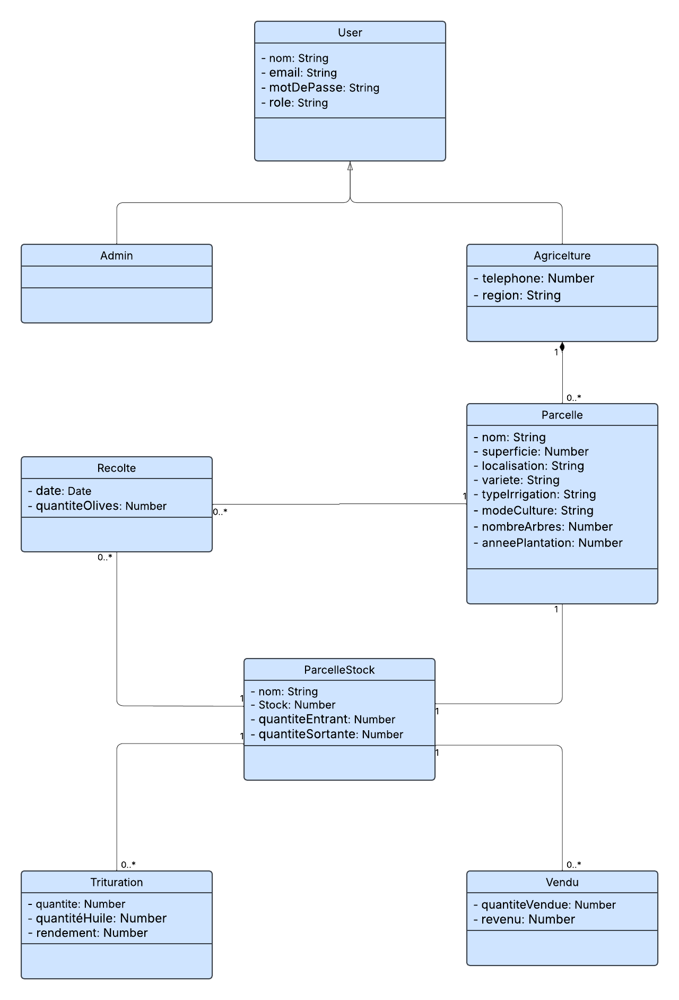
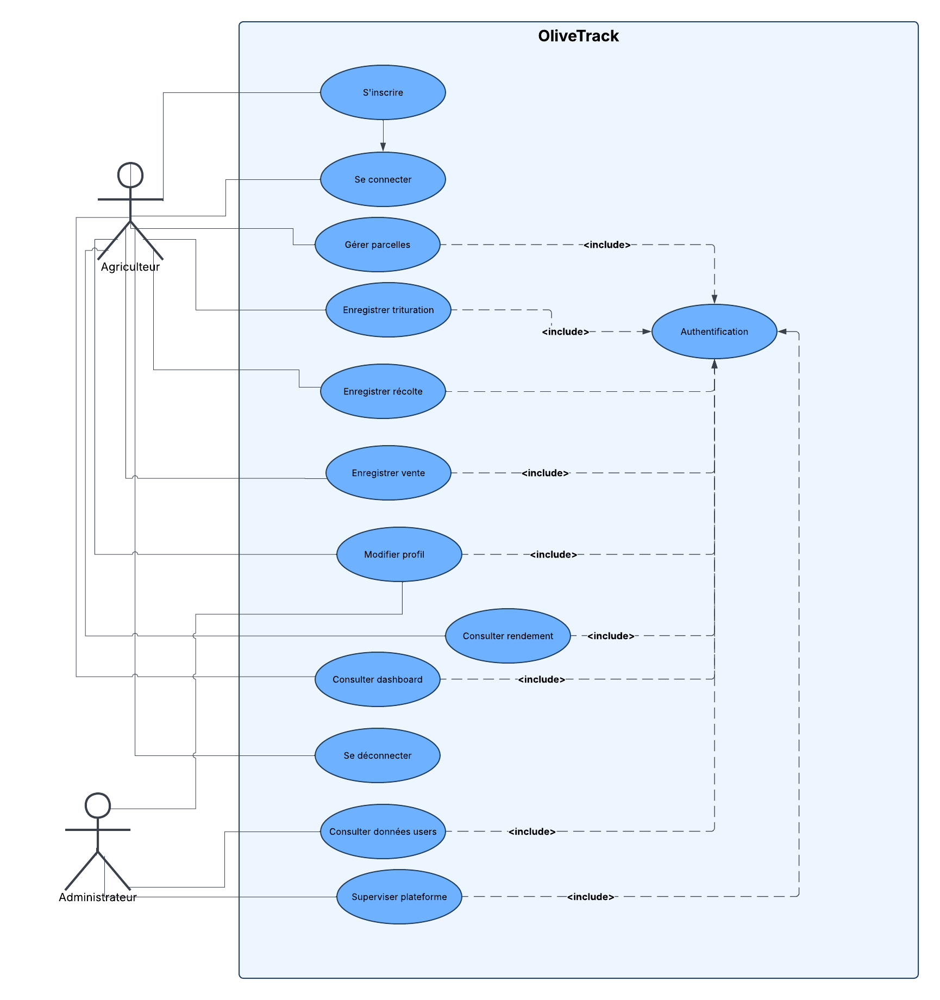
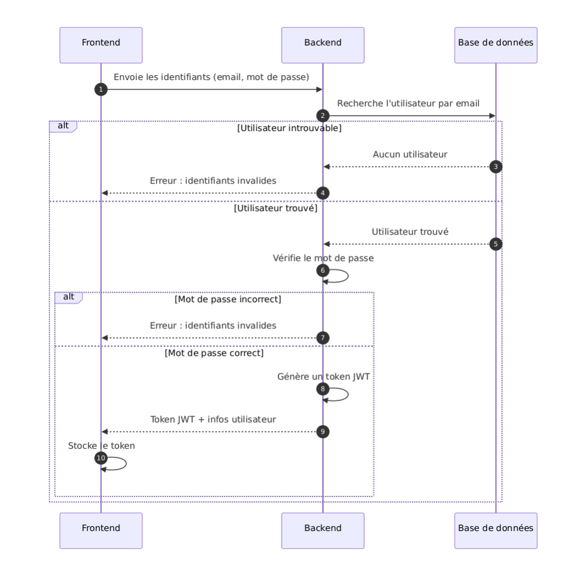

# OliveTrack

Monorepo contenant le backend (Node.js/Express) et le frontend (React) du projet OliveTrack.

## Structure

- `back-end/` — API REST (voir back-end/README.md)
- `front-end/` — Application React (voir front-end/README.md)

## Installation

Voir le README de chaque dossier séparément.

## diagramme de classe

## diagramme use case

## diagramme de sequence 

