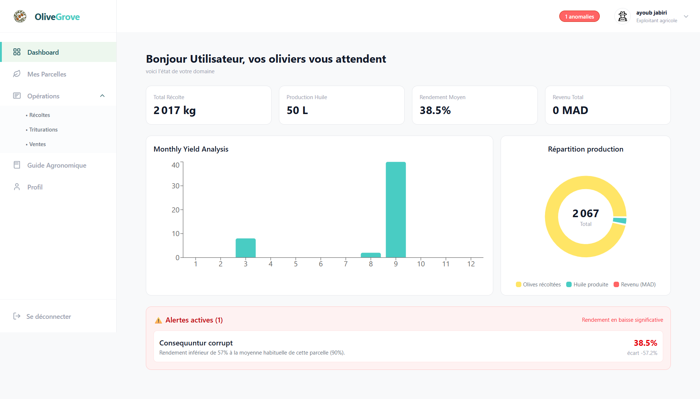
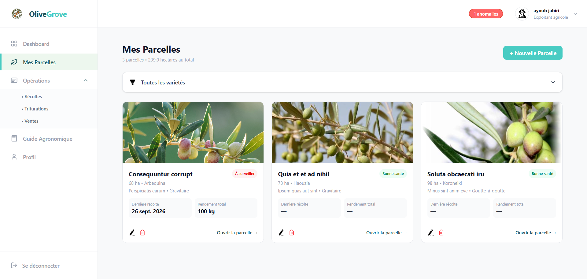
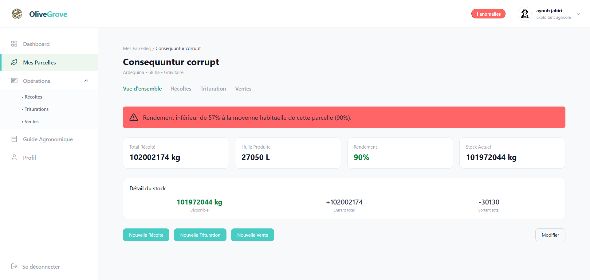
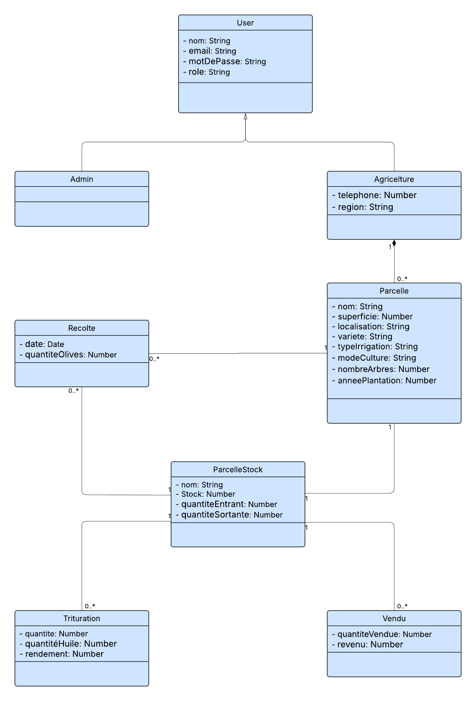
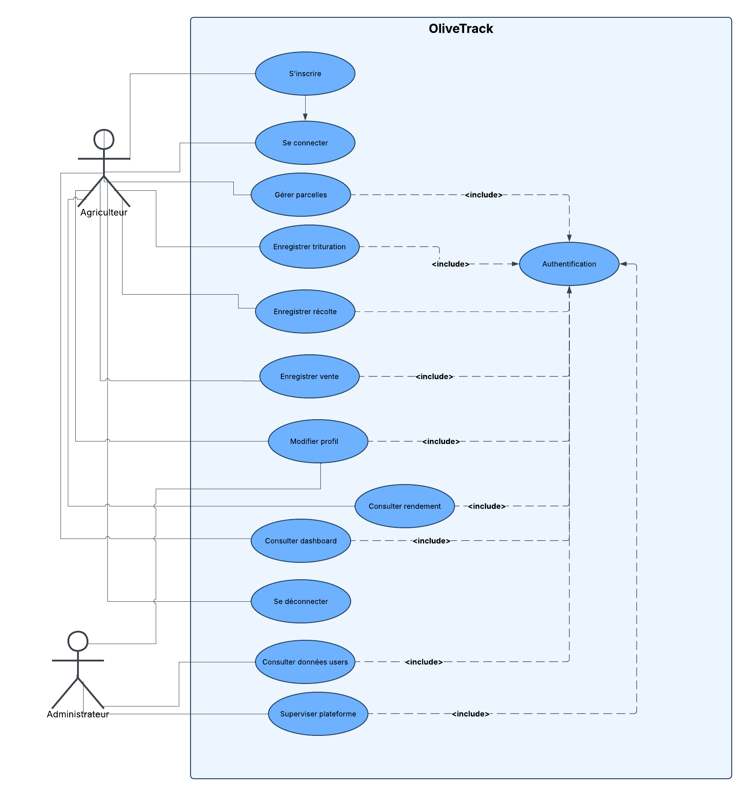
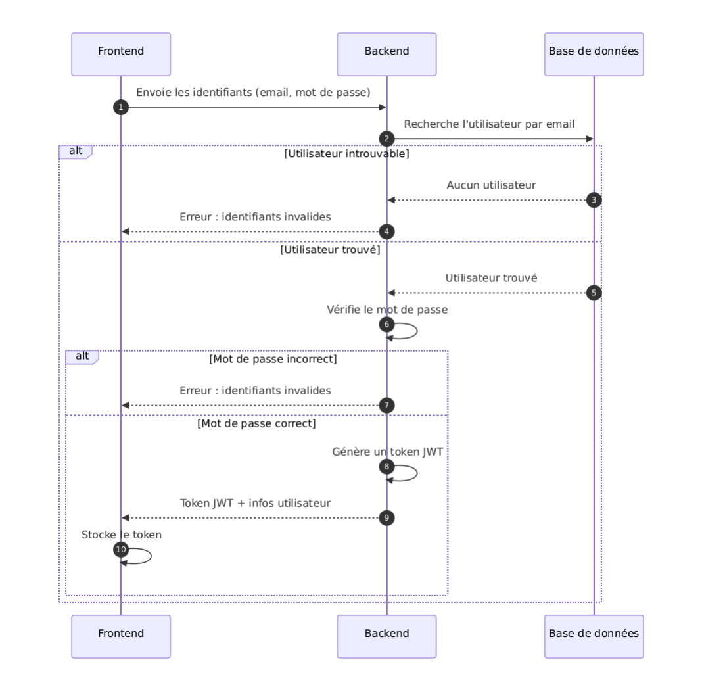

# OliveTrack

---

# 1. Nom du projet

**Nom du projet :** OliveTrack — Application web de gestion d'une exploitation oléicole

---

# 2. Présentation du projet

Ce projet est une **application web full-stack** (API REST Node.js/Express + interface React) qui permet de centraliser la gestion d'une exploitation oléicole : parcelles, récoltes, stock d'olives, trituration (transformation des olives en huile) et ventes.

Il s'adresse principalement aux **agriculteurs oléiculteurs** qui gèrent une ou plusieurs parcelles, ainsi qu'à un **administrateur** chargé de superviser la plateforme.

Son objectif principal est de **digitaliser le suivi de la production oléicole**, en remplaçant les carnets papier et les tableurs dispersés par une plateforme unique : stock mis à jour automatiquement, rendement calculé à chaque trituration et alerte en cas de baisse de performance d'une parcelle.

---

# 3. Problématique

Le problème identifié est que la gestion des exploitations oléicoles est encore souvent réalisée de manière manuelle (carnets papier, tableurs isolés), ce qui rend le suivi des parcelles, des récoltes, du stock et du rendement difficile, sans vision consolidée ni alerte en cas de baisse de performance.

La solution proposée permet d'enregistrer les parcelles et les récoltes (qui alimentent automatiquement le stock de chaque parcelle), d'enregistrer les triturations et les ventes, puis de comparer le rendement d'une parcelle d'une année à l'autre afin de détecter automatiquement une baisse significative.

---

# 4. Fonctionnalités principales

- **Créer** un compte agriculteur, **se connecter** de façon sécurisée (JWT) et **modifier** son profil
- **Gérer** ses parcelles (ajouter, consulter, modifier, supprimer)
- **Enregistrer** une récolte, qui alimente automatiquement le stock d'olives de la parcelle
- **Enregistrer** une trituration (olives → huile, avec calcul automatique du rendement) et une vente d'olives (avec suivi du revenu)
- **Consulter** le tableau de bord du rendement par parcelle et **recevoir** une alerte en cas de baisse significative (seuil de -20 %)
- **Consulter** un guide agronomique mensuel (irrigation, taille, fertilisation, récolte, trituration)

> Le rôle **administrateur** (unique dans le système) permet en plus de superviser les utilisateurs et les statistiques globales (voir Annexe B).

---

# 5. Technologies utilisées

| Technologie | Utilisation dans le projet |
|-------------|----------------------------|
| Node.js & Express.js | Backend et API REST |
| MongoDB & Mongoose | Stockage des données |
| JWT (jsonwebtoken) | Authentification |
| Bcrypt | Hachage des mots de passe |
| Joi | Validation des données entrantes |
| Jest, Supertest, mongodb-memory-server | Tests unitaires et d'intégration |
| Docker, docker-compose | Conteneurisation de l'API et de MongoDB |
| GitHub Actions | Intégration continue (lint, tests, build) |
| Postman | Tests manuels de l'API |
| React & Vite | Interface utilisateur et outil de lancement du frontend |
| React Router | Navigation entre les pages et routes protégées |
| Redux Toolkit | Gestion centralisée de l'état (authentification, parcelles, récoltes, ventes...) |
| Axios | Appels HTTP vers l'API, avec ajout automatique du token JWT |
| Tailwind CSS | Mise en forme et design de l'interface |
| Recharts & Lucide React | Graphiques et icônes |
| Git & GitHub | Versionnement du code |

---

# 6. Installation et lancement

## 6.1 Prérequis

Pour utiliser ce projet, vous devez disposer de :

- **Node.js** (version 18 ou supérieure)
- **npm**
- **Git**
- **MongoDB** (installation locale ou instance MongoDB Atlas), ou **Docker**
- **Un éditeur de code** comme VS Code

---

## 6.2 Cloner le dépôt

```bash
git clone https://github.com/imaneimziline2-netizen/olivetrack-app.git
```

---

## 6.3 Ouvrir le dossier

Le dépôt contient deux projets : `back-end/` et `front-end/`.

```bash
cd olivetrack-app
```

---

## 6.4 Installer les dépendances

**Backend :**

```bash
cd back-end
npm install
```

**Frontend** (dans un second terminal, depuis `olivetrack-app`) :

```bash
cd front-end
npm install
```

---

## 6.5 Variables d'environnement

**Backend** — créer un fichier `.env` dans `back-end/` :

```env
PORT=5000
MONGO_URL=mongodb://localhost:27017/olivetrack
JWT_SECRET=votre_secret_jwt
```

**Frontend** — aucune variable d'environnement n'est nécessaire. L'adresse de l'API est fixée dans `front-end/src/services/api.js` (`http://localhost:5000/api`) : le backend doit donc tourner sur le port **5000** (`PORT=5000`).

---

## 6.6 Lancer le projet

**Backend :**

```bash
cd back-end
npm run dev
```

ou, avec Docker (API + MongoDB) :

```bash
cd back-end
docker compose up --build
```

**Frontend :**

```bash
cd front-end
npm run dev
```

**Lancer les tests du backend :**

```bash
cd back-end
npm test
```

---

## 6.7 Ouvrir le projet

Après le lancement :

- Application (frontend) : `http://localhost:5173` (utiliser l'adresse exacte affichée par Vite si le port est différent)
- Vérification de l'API : `http://localhost:5000/health`

### Point de vigilance

- Le fichier `.env` ne doit **jamais** être publié sur GitHub (exclu via `.gitignore` et `.dockerignore`) : ni mot de passe, ni clé, ni token.
- Le code lit la variable **`MONGO_URL`**. Certains anciens fichiers (README d'origine, `docker-compose.yml`) utilisent encore le nom `MONGO_URI` : ce nom doit être harmonisé en `MONGO_URL`, sinon le backend ne trouve pas l'adresse de la base de données.
- Le compte administrateur ne peut pas être créé via `/api/auth/register` : il est créé manuellement (inscription standard, puis bascule du champ `role` en base), ce qui garantit qu'un seul administrateur existe.

---

# 7. Captures d'écran

## Capture 1

### Titre

**Tableau de bord**

### Image



### Explication

Cette capture montre le tableau de bord de l'application. Il permet de consulter rapidement le rendement de chaque parcelle de l'exploitation et les alertes de baisse de performance.

---

## Capture 2

### Titre

**Gestion des parcelles**

### Image



### Explication

Cette capture montre l'interface permettant de consulter, filtrer par variété, modifier et supprimer les parcelles de l'exploitation.

---
## Capture 3

### Titre

**Détail d'une parcelle**

### Image


### Explication

Cette capture montre la page de détail d'une parcelle : ses informations (variété, superficie, irrigation), le total récolté, l'huile produite, le rendement et le stock actuel avec ses entrées et sorties. Elle affiche aussi l'alerte automatique en cas de baisse de rendement (seuil de -20 %) et les boutons pour enregistrer une récolte, une trituration ou une vente.

---

# 8. Contribution personnelle

Ma contribution principale a porté sur la conception et le développement de l'API REST (authentification, parcelles, récoltes, triturations, ventes, tableau de bord, administration) et du modèle de données MongoDB.

J'ai également travaillé sur l'interface React : création des pages, navigation avec React Router, gestion de l'état avec Redux et appels à l'API avec Axios.

J'ai été responsable de la sécurité (JWT, contrôle de propriété des ressources, contrainte d'administrateur unique), du calcul du rendement avec détection d'anomalie, ainsi que des tests automatisés, de la conteneurisation Docker et de l'intégration continue.

---

# 9. Difficultés rencontrées

## Difficulté 1 — Erreurs de résolution de modules ES Modules (`ERR_MODULE_NOT_FOUND`)

### Problème rencontré

Le serveur s'arrêtait au démarrage avec des erreurs `Cannot find module`.

### Recherches / Tests

J'ai lu le message d'erreur et vérifié, import par import, l'extension et le chemin des fichiers concernés.

### Solution

L'extension `.js` est obligatoire dans les imports en ES Modules, et le chemin doit correspondre exactement à l'emplacement physique du fichier.

### Ce que j'ai appris

Toujours vérifier l'extension et le chemin avant de chercher un bug plus complexe.

---

## Difficulté 2 — Évolution du modèle de données en cours de projet

### Problème rencontré

Le modèle initial (`Production` unique) a dû être remplacé par `ParcelleStock`, `Trituration` et `Vendu` après la validation d'un nouveau diagramme de classes.

### Recherches / Tests

J'ai comparé le nouveau diagramme de classes avec le code existant pour identifier les modules réellement impactés.

### Solution

Grâce à des services découplés, avec un contrôle de propriété assuré par des fonctions dédiées, seul le module `Production` a été retiré, sans impacter `Parcelles` ni `Récoltes`.

### Ce que j'ai appris

L'importance de concevoir des couches indépendantes pour absorber un changement de modèle sans tout casser.

---

## Difficulté 3 — Faille de sécurité : contrôle de propriété manquant sur les ressources imbriquées

### Problème rencontré

Les routes `GET/DELETE /api/triturations/:id` et `/api/ventes/:id` vérifiaient seulement l'authentification, pas la propriété réelle de la ressource : un agriculteur pouvait accéder aux données d'un autre.

### Recherches / Tests

J'ai testé ces routes avec le token d'un autre utilisateur, ce qui a confirmé que l'accès n'était pas refusé.

### Solution

Création de middlewares dédiés (`checkRecolteAccess`, `checkTriturationAccess`, `checkVenduAccess`) qui remontent jusqu'à la parcelle parente pour vérifier le propriétaire réel.

### Ce que j'ai appris

Un middleware générique de propriété ne suffit pas dès qu'une ressource n'a pas de `userId` direct : chaque relation indirecte doit être vérifiée explicitement.

---

## Difficulté 4 — Contrainte « un seul administrateur » non fiable au niveau applicatif

### Problème rencontré

Un middleware vérifiant l'unicité de l'administrateur avant la création ne suffisait pas : une modification directe en base (MongoDB Compass) pouvait créer un second administrateur sans passer par l'API.

### Recherches / Tests

J'ai reproduit le cas en modifiant directement le champ `role` d'un utilisateur dans MongoDB Compass.

### Solution

Ajout d'un index unique partiel MongoDB (`partialFilterExpression: { role: "admin" }`) qui garantit la contrainte au niveau de la base de données, quel que soit le point d'entrée de l'écriture.

### Ce que j'ai appris

Les règles métier critiques doivent être protégées au niveau le plus bas possible (la base de données), et pas seulement au niveau applicatif.

---

## Difficulté 5 — Gestion de l'état partagé entre les composants

### Problème rencontré

Les données partagées entre plusieurs pages (utilisateur connecté, parcelles, récoltes...) devenaient difficiles à gérer lorsque chaque composant conservait son propre état.

### Recherches / Tests

J'ai étudié différentes solutions de gestion d'état et testé Redux pour centraliser les données utilisées par plusieurs parties de l'application.

### Solution

J'ai utilisé Redux Toolkit (un slice par domaine : `auth`, `parcelles`, `recoltes`, `triturations`, `ventes`, `dashboard`, `admin`) pour que tous les composants accèdent aux mêmes données.

### Ce que j'ai appris

Une meilleure compréhension de la gestion d'état dans React et de l'organisation d'une application front-end.

---

# 10. Améliorations possibles

Dans une prochaine version, je pourrais :

- **Étendre la couverture de tests** (endpoints Parcelles, Trituration, Vendu, tests de sécurité supplémentaires).
- **Documenter l'API** avec Swagger/OpenAPI.
- **Rendre l'interface responsive** pour l'adapter aux smartphones et aux tablettes.
- **Déployer l'application** sur un hébergeur cloud avec MongoDB Atlas.

### Conclusion

Ces améliorations permettraient de fiabiliser l'application, de faciliter sa prise en main par d'autres développeurs et de la rendre utilisable en conditions réelles dans une exploitation oléicole.

---

# Annexes

## Annexe A — Modèle de données

```text
User (nom, email, motDePasse, role, region, telephone : agriculteur | admin — un seul admin dans le système)
  └── Parcelle (nom, superficie, localisation, variete, typeIrrigation, modeCulture, nombreArbres, anneePlantation)
        ├── Recolte (date, quantiteOlives)                            → alimente automatiquement ParcelleStock
        └── ParcelleStock (nom, Stock, quantiteEntrant, quantiteSortante)   → 1 par parcelle
              ├── Trituration (date, quantite, quantiteHuile, rendement)    → consomme du stock d'olives, produit de l'huile
              └── Vendu (date, quantiteVendue, revenu)                      → vend des olives directement depuis le stock
```

- **Unités** : toutes les quantités du stock (récolte, trituration, vente) sont exprimées en **kg d'olives**. La quantité d'huile produite est enregistrée dans `Trituration` (`quantiteHuile`).
- **Rendement** : `quantiteHuile / quantite × 100`, calculé et stocké à chaque trituration. Le rendement annuel d'une parcelle est calculé à la volée (agrégation des triturations de l'année), puis comparé à la moyenne des années précédentes (3 au maximum, 2 minimum) : une alerte est déclenchée si l'écart est de -20 % ou moins.
- **Contrainte administrateur unique** : garantie au niveau base de données par un index unique partiel MongoDB sur `role: "admin"`.

## Annexe B — Endpoints de l'API

| Module | Endpoints | Accès |
|---|---|---|
| Santé | `GET /health` | Public |
| Auth | `POST /api/auth/register`, `POST /api/auth/login` | Public |
| Users | `GET /api/users/me`, `PUT /api/users/me` | Connecté |
| Parcelles | `POST /api/parcelles`, `GET /api/parcelles`, `GET/PUT/DELETE /api/parcelles/:id`, `GET /api/parcelles/:id/stock`, `GET /api/parcelles/:id/rendement` | Connecté + propriétaire |
| Récoltes | `POST/GET /api/parcelles/:parcelleId/recoltes`, `GET/PUT/DELETE /api/recoltes/:id` | Connecté + propriétaire |
| Triturations | `POST/GET /api/parcelles/:parcelleId/triturations`, `GET/PUT/DELETE /api/triturations/:id` | Connecté + propriétaire |
| Ventes | `POST/GET /api/parcelles/:parcelleId/ventes`, `GET/PUT/DELETE /api/ventes/:id` | Connecté + propriétaire |
| Dashboard | `GET /api/dashboard?annee=YYYY`, `GET /api/dashboard/monthly`, `GET /api/dashboard/rendement/:id` | Connecté |
| Admin | `GET /api/admin/users`, `GET /api/admin/users/:id`, `DELETE /api/admin/users/:id` (suppression en cascade des parcelles et données associées), `GET /api/admin/stats` | Administrateur |

> Le guide agronomique est affiché par le frontend à partir de données statiques (`front-end/src/data/guideAgronomiqueData.js`) : il n'a pas d'endpoint côté API.

## Annexe C — Sécurité

- Mots de passe hachés avec Bcrypt, jamais renvoyés dans les réponses de l'API.
- Authentification par JWT (durée de validité : 7 jours), middleware dédié sur toutes les routes protégées.
- Contrôle de propriété assuré par des middlewares dédiés pour chaque ressource (parcelle directe ; récolte, trituration et vente via leur parcelle parente) : un agriculteur ne peut pas accéder aux données d'un autre.
- Rôle `admin` non injectable via l'API : toujours forcé à `agriculteur` côté serveur à l'inscription, et un seul compte administrateur peut exister (contrainte base de données).
- Validation stricte des entrées avec Joi, qui rejette tout champ non attendu.
- Le rendement n'est jamais accepté depuis le client : il est toujours recalculé côté serveur.
- Côté frontend, `ProtectedRoute` limite l'accès aux pages selon la connexion et le rôle (la vraie protection reste celle du backend).

## Annexe D — Tests

8 tests automatisés (`npm test` dans `back-end/`), couvrant :

- la contrainte d'administrateur unique au niveau base de données (test unitaire) ;
- le calcul du rendement, y compris les cas limites (test unitaire) ;
- l'inscription, le rejet d'un email dupliqué et le forçage du rôle (tests d'intégration avec `mongodb-memory-server` et `supertest`).

## Annexe E — Structure du projet

```text
olivetrack-app/
├── back-end/
│   ├── src/
│   │   ├── config/          → connexion MongoDB
│   │   ├── middlewares/     → authentification, rôles, propriété, validation des :id
│   │   ├── modules/         → admin, auth, dashboard, parcelles, recoltes, triturations, users, ventes
│   │   └── utils/           → JWT, calcul du rendement, détection d'anomalie, gestion des erreurs
│   └── tests/
│       ├── integration/
│       └── unit/
└── front-end/
    ├── store/               → store Redux et slices (auth, parcelles, récoltes, triturations, ventes, dashboard, admin)
    └── src/
        ├── components/      → layout (Navbar, Sidebar), ProtectedRoute, composants UI réutilisables
        ├── pages/           → auth, dashboard, parcelles, récoltes, triturations, ventes, guide, profil, admin
        ├── routes/          → AppRouter
        ├── services/        → appels Axios (api.js + un service par domaine)
        ├── data/            → données du guide agronomique
        ├── utils/
        └── assets/
```

## Annexe F — Diagrammes de conception

**Diagramme de classes**



**Diagramme de cas d'utilisation**



**Diagramme de séquence**

